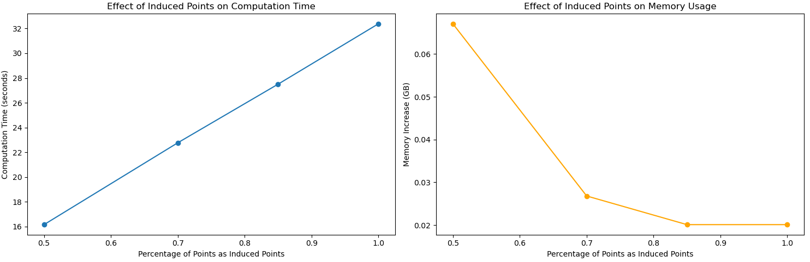
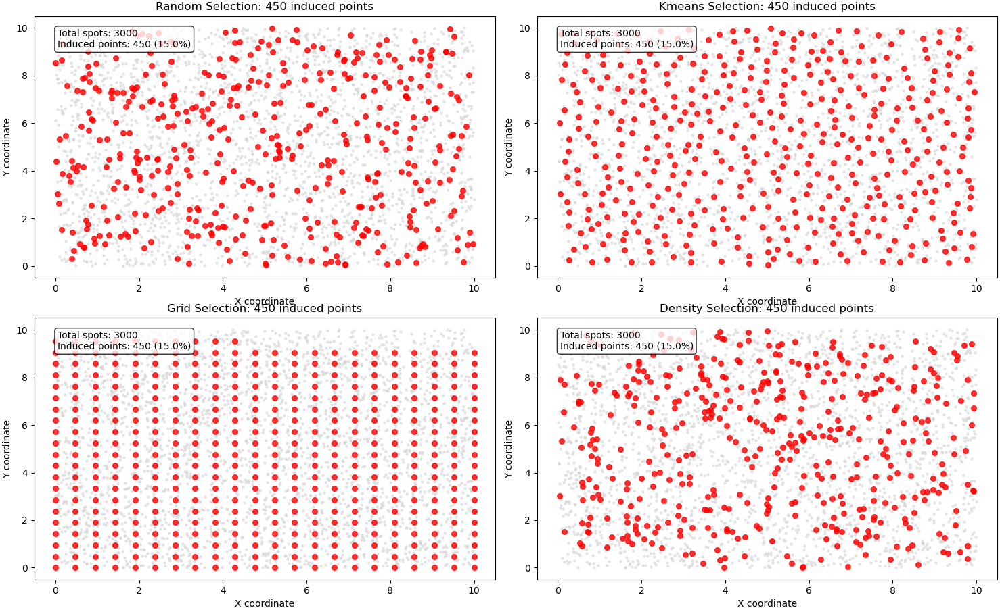

# Large Dataset Optimization Techniques for mNSF

**Authors:** Yi Wang, Kasper Hansen, and the mNSF Team  
**Date:** March 2025

## Overview

As spatial transcriptomics technologies advance, datasets are becoming increasingly large, with some experiments containing tens of thousands of spots and thousands of genes across multiple samples. Running mNSF on such datasets can be challenging due to memory limitations and computational complexity. This tutorial provides practical strategies for optimizing mNSF for large datasets, with particular emphasis on:

1. Efficient data chunking strategies
2. Optimal selection of induced points
3. Memory profiling and management
4. Parallel processing implementation
5. Pre-processing techniques for dimensionality reduction

## 1. Understanding Computational Challenges

The computational complexity of mNSF increases significantly with dataset size:

- Memory usage scales with the number of spots, genes, and factors
- Computation time increases with the number of spots due to Gaussian Process calculations
- Multiple samples compound these challenges

Before diving into optimization techniques, let's understand the main bottlenecks:

```python
import mNSF
from mNSF import large_dataset_optimication as ldo
from mNSF import process_multiSample
from mNSF.NSF import preprocess, misc, visualize
from mNSF import training_multiSample
import numpy as np
import pandas as pd
import matplotlib.pyplot as plt
import tensorflow as tf
import os
from os import path
import time
import psutil
import random

# estimate memory requirements

# Example usage
print("Memory estimates for different dataset sizes:")
# Memory estimates for different dataset sizes:

print("\nMedium dataset (10k spots, 2k genes, 10 factors, 2 samples):")
print(ldo.estimate_memory(10000, 2000, 10, 2))
# Medium dataset (10k spots, 2k genes, 10 factors, 2 samples):

print("\nLarge dataset (50k spots, 5k genes, 15 factors, 3 samples):")
print(ldo.estimate_memory(50000, 5000, 15, 3))
# {'data_memory_GB': 0.14901161193847656, 'coordinate_memory_GB': 0.00014901161193847656, 'factor_memory_GB': 0.0014901161193847656, 'loading_memory_GB': 0.00014901161193847656, 'estimated_total_GB': 0.22619962692260742}

print("\nVery large dataset (100k spots, 10k genes, 20 factors, 4 samples):")
print(ldo.estimate_memory(100000, 10000, 20, 4))
# {'data_memory_GB': 7.450580596923828, 'coordinate_memory_GB': 0.0014901161193847656, 'factor_memory_GB': 0.059604644775390625, 'loading_memory_GB': 0.0014901161193847656, 'estimated_total_GB': 11.269748210906982}

# Actual memory monitoring function
def monitor_memory_usage():
    # Get current process
    process = psutil.Process(os.getpid())
    # Return memory usage in GB
    return process.memory_info().rss / (1024 ** 3)

monitor_memory_usage()
# 0.7516632080078125

## 2. Memory Management Techniques

As the size of your dataset grows, memory management becomes increasingly important. Here are strategies to minimize memory usage during mNSF analysis:

### 2.1 TensorFlow Memory Optimization

```python

# Call this function before running mNSF
ldo.configure_tensorflow_memory()
```

### 2.1 Memory Monitoring

It's important to monitor memory usage during mNSF runs, especially for large datasets. Here's a wrapper that can help track memory usage during model training:

```python
def memory_monitored_training(list_fit, pp, list_Dtrain, list_D, num_epochs=500, 
                              nsample=1, nchunk=1, verbose=True):
    """
    Wrapper around mNSF training function that monitors memory usage.
    
    Parameters are the same as training_multiSample.train_model_mNSF
    """
    # Initial memory usage
    initial_mem = monitor_memory_usage()
    print(f"Initial memory usage: {initial_mem:.2f} GB")
    
    # Track memory at each epoch
    memory_usage = []
    peak_memory = initial_mem
    
    # Custom callback function to track memory
    def memory_callback(epoch, loss):
        nonlocal peak_memory
        current_mem = monitor_memory_usage()
        memory_usage.append(current_mem)
        peak_memory = max(peak_memory, current_mem)
        
        if verbose and epoch % 10 == 0:
            print(f"Epoch {epoch}: Loss = {loss:.4f}, Memory = {current_mem:.2f} GB")
    
    # Start training timer
    start_time = time.time()
    
    # Run the mNSF training function
    # Note: This assumes the train_model_mNSF function accepts a callback parameter
    # You may need to modify the actual mNSF code to add this functionality
    list_fit = training_multiSample.train_model_mNSF(
        list_fit, pp, list_Dtrain, list_D, 
        num_epochs=num_epochs, nsample=nsample, nchunk=nchunk,
        verbose=False  # Turn off default verbose since we have our own callback
    )
    
    # End training timer
    end_time = time.time()
    training_time = end_time - start_time
    
    # Print summary
    print("\nTraining complete!")
    print(f"Total training time: {training_time:.2f} seconds")
    print(f"Peak memory usage: {peak_memory:.2f} GB")
    print(f"Memory increase during training: {peak_memory - initial_mem:.2f} GB")
    
    # Plot memory usage
    plt.figure(figsize=(10, 5))
    plt.plot(range(len(memory_usage)), memory_usage)
    plt.xlabel('Epoch')
    plt.ylabel('Memory Usage (GB)')
    plt.title('Memory Usage During Training')
    plt.grid(True)
    plt.tight_layout()
    plt.show()
    
    return list_fit, {
        'training_time': training_time,
        'peak_memory': peak_memory,
        'memory_increase': peak_memory - initial_mem,
        'memory_profile': memory_usage,
        'final_loss': list_fit[-1]["ELBO_loss"] if len(list_fit) > 0 else None,
        'epochs_completed': len(list_fit),
        'samples': nsample,
        'chunks': nchunk
    }
 
```

## 3. Optimizing Induced Points

Induced points are a critical optimization in mNSF that reduce the computational complexity of Gaussian processes. Selecting the right number and distribution of induced points is essential for balancing accuracy and performance.

### 3.1 Number of Induced Points

The number of induced points directly impacts both computational efficiency and model accuracy:

```python
## Example
# Generate spatial coordinates in a 10x10 grid
x = np.random.uniform(0, 10, 3000)
y = np.random.uniform(0, 10, 3000)
X = np.column_stack((x, y))
X_df = pd.DataFrame(X, columns=['x', 'y'])
ldo.induced_points_analysis(X_df, percentages=[0.5, 0.7, 0.85, 1])
#    percentage  n_induced  time_seconds  memory_delta_GB  matrix_size_GB
# 0        0.50       1500     16.160952         0.067062        0.033528
# 1        0.70       2100     22.770177         0.026817        0.046939
# 2        0.85       2550     27.504231         0.020119        0.056997
# 3        1.00       3000     32.378558         0.020119        0.067055

```


### 3.2 Strategic Selection of Induced Points

Rather than random selection, strategically choosing induced points can improve model accuracy:

```python

# example
ldo.visualize_induced_points(X_df, percentage=0.15)
```

