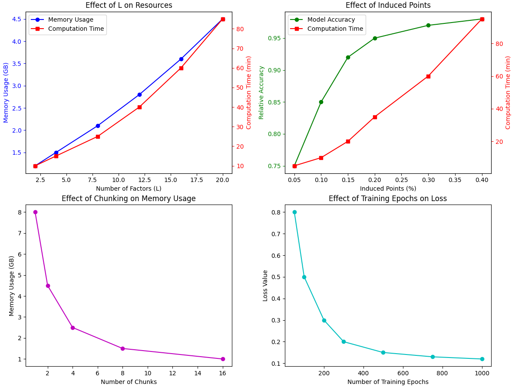

# Effect of Parameter Selection 
**Authors:** Yi Wang, Kasper Hansen, and the mNSF Team  
**Date:** March 2025

## 1. Understanding mNSF Parameters

Before diving into selection strategies, let's review the key parameters in mNSF and their roles:

```python
# Import necessary libraries
import mNSF
from mNSF import process_multiSample
from mNSF.NSF import preprocess, misc, visualize
from mNSF import training_multiSample
from mNSF import MoranI
import numpy as np
import pandas as pd

import matplotlib.pyplot as plt
import seaborn as sns
from os import path
import tensorflow as tf
import random
import time
from sklearn.model_selection import KFold
```

### 1.1 Core Parameters

| Parameter | Description | Affects | Default Value |
|-----------|-------------|---------|---------------|
| L | Number of factors | Model complexity, interpretability | N/A (must be specified) |
| nsample | Number of samples | Multi-sample integration | N/A (must be specified) |
| nchunk | Number of data chunks | Memory usage, training speed | 1 |
| num_epochs | Training iterations | Convergence, training time | 500 |
| induced_points | Points for GP approximation | Computational efficiency, accuracy | ~15% of spots |

### 1.2 Parameter Interactions

Parameters in mNSF interact with each other:

- Higher L requires more computational resources
- More samples (nsample) increases the complexity but improves statistical power
- More chunks (nchunk) reduces memory usage but may affect convergence
- More induced points improves accuracy but increases computation time

Let's visualize these interactions:

```python
def visualize_parameter_interactions():
    """Visualize how parameters interact with each other."""
    
    # Create figure
    fig, axes = plt.subplots(2, 2, figsize=(12, 10))
    
    # 1. Effect of L on memory and computation time
    L_values = [2, 4, 8, 12, 16, 20]
    memory_usage = [1.2, 1.5, 2.1, 2.8, 3.6, 4.5]  # Simulated GB
    computation_time = [10, 15, 25, 40, 60, 85]    # Simulated minutes
    
    ax1 = axes[0, 0]
    ax1_twin = ax1.twinx()
    
    ax1.plot(L_values, memory_usage, 'b-o', label='Memory Usage')
    ax1.set_xlabel('Number of Factors (L)')
    ax1.set_ylabel('Memory Usage (GB)', color='b')
    ax1.tick_params(axis='y', colors='b')
    
    ax1_twin.plot(L_values, computation_time, 'r-s', label='Computation Time')
    ax1_twin.set_ylabel('Computation Time (min)', color='r')
    ax1_twin.tick_params(axis='y', colors='r')
    
    ax1.set_title('Effect of L on Resources')
    
    lines1, labels1 = ax1.get_legend_handles_labels()
    lines2, labels2 = ax1_twin.get_legend_handles_labels()
    ax1.legend(lines1 + lines2, labels1 + labels2, loc='upper left')
    
    # 2. Effect of induced points percentage on accuracy and computation time
    induced_pct = [0.05, 0.1, 0.15, 0.2, 0.3, 0.4]
    accuracy = [0.75, 0.85, 0.92, 0.95, 0.97, 0.98]  # Simulated accuracy
    induced_time = [5, 10, 20, 35, 60, 95]           # Simulated minutes
    
    ax2 = axes[0, 1]
    ax2_twin = ax2.twinx()
    
    ax2.plot(induced_pct, accuracy, 'g-o', label='Model Accuracy')
    ax2.set_xlabel('Induced Points (%)')
    ax2.set_ylabel('Relative Accuracy', color='g')
    ax2.tick_params(axis='y', colors='g')
    
    ax2_twin.plot(induced_pct, induced_time, 'r-s', label='Computation Time')
    ax2_twin.set_ylabel('Computation Time (min)', color='r')
    ax2_twin.tick_params(axis='y', colors='r')
    
    ax2.set_title('Effect of Induced Points')
    
    lines1, labels1 = ax2.get_legend_handles_labels()
    lines2, labels2 = ax2_twin.get_legend_handles_labels()
    ax2.legend(lines1 + lines2, labels1 + labels2, loc='upper left')
    
    # 3. Effect of chunks on memory usage
    nchunk_values = [1, 2, 4, 8, 16]
    chunk_memory = [8, 4.5, 2.5, 1.5, 1.0]  # Simulated GB
    
    ax3 = axes[1, 0]
    ax3.plot(nchunk_values, chunk_memory, 'm-o')
    ax3.set_xlabel('Number of Chunks')
    ax3.set_ylabel('Memory Usage (GB)')
    ax3.set_title('Effect of Chunking on Memory Usage')
    
    # 4. Effect of epochs on model quality
    epochs = [50, 100, 200, 300, 500, 750, 1000]
    loss = [0.8, 0.5, 0.3, 0.2, 0.15, 0.13, 0.12]  # Simulated loss
    
    ax4 = axes[1, 1]
    ax4.plot(epochs, loss, 'c-o')
    ax4.set_xlabel('Number of Training Epochs')
    ax4.set_ylabel('Loss Value')
    ax4.set_title('Effect of Training Epochs on Loss')
    
    plt.tight_layout()
    plt.show()

# Visualize parameter interactions
visualize_parameter_interactions()
```




