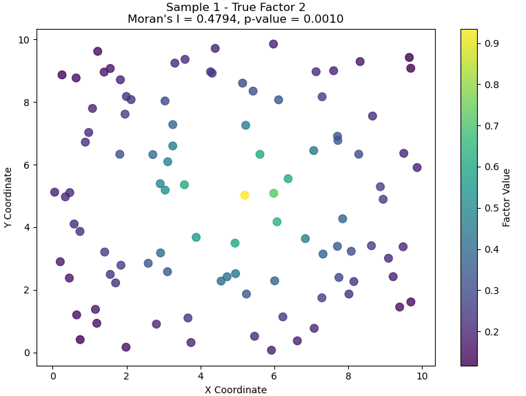
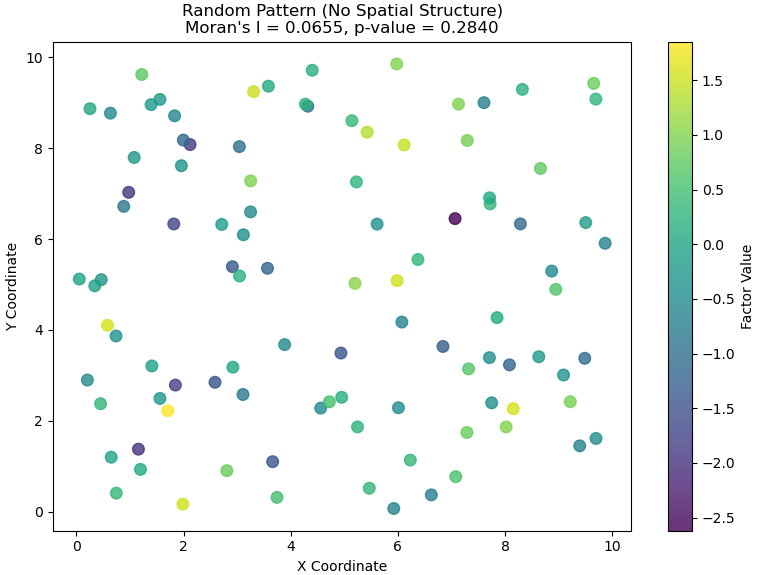
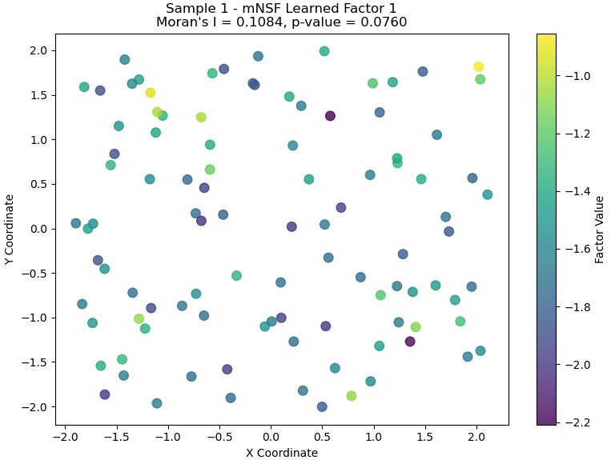
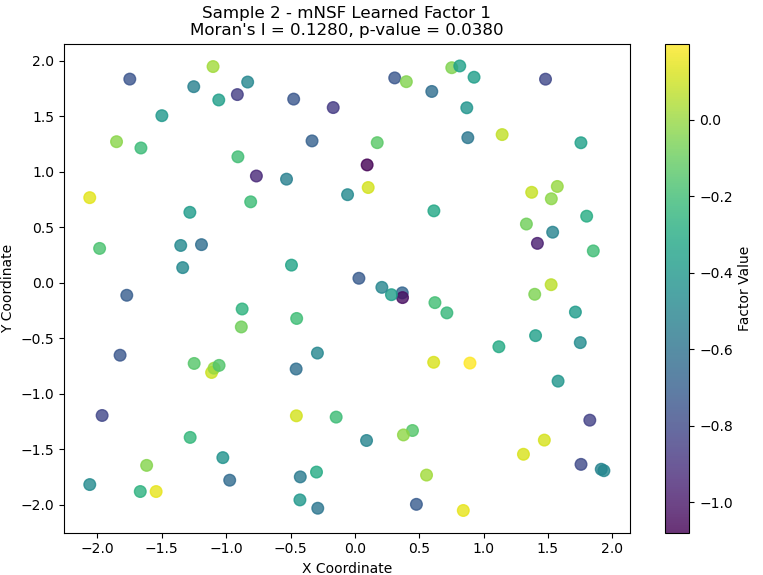

# Illustrating Spatial Autocorrelation with Moran's I in mNSF

**Authors:** Your Name  
**Date:** March 30, 2025

## 1. Introduction to Spatial Autocorrelation

Spatial autocorrelation is a fundamental concept in spatial data analysis that measures the degree to which data points at proximate locations are correlated with each other. In the context of spatial transcriptomics, we're often interested in determining whether gene expression patterns show significant spatial structure - that is, whether similar expression levels tend to cluster together in space.

Moran's I is one of the most widely used statistics for measuring spatial autocorrelation. It ranges from -1 to +1:

- **Values close to +1** indicate strong positive spatial autocorrelation (similar values cluster together)
- **Values close to 0** suggest random spatial distribution (no autocorrelation)
- **Values close to -1** indicate strong negative spatial autocorrelation (dissimilar values cluster together)

This tutorial demonstrates how to calculate and interpret Moran's I for spatial factors derived from multi-sample Non-negative Spatial Factorization (mNSF).

## 2. Setup and Data Preparation

Let's start by setting up our environment and generating the same synthetic data used in the "Getting Started with mNSF" tutorial.

```python
# Import required packages
import os
import numpy as np
import pandas as pd
import matplotlib.pyplot as plt
import random
import tensorflow as tf
from os import path
import pickle
import seaborn as sns
from scipy import stats

# Import mNSF modules
from mNSF import process_multiSample
from mNSF.NSF import preprocess, misc, visualize
from mNSF import training_multiSample
from mNSF import MoranI  # This is the module we'll focus on

# Import utility functions
from mNSF import mnsf_utility

# Set random seeds for reproducibility
random.seed(42)
np.random.seed(42)
tf.random.set_seed(42)

# Generate synthetic data
simulated_data = mnsf_utility.pre_processing_simulation(
    n_samples=2,
    n_spots=100,
    n_genes=50,
    n_factors=2,
    output_dir="synthetic_data"
)

print(f"Generated synthetic data with:")
for i in range(2):
    print(f"Sample {i+1}: {simulated_data['list_Y'][i].shape[0]} spots, {simulated_data['list_Y'][i].shape[1]} genes")
```

## 3. Understanding Moran's I Calculation

Before applying Moran's I to our data, let's understand how it's calculated:

1. **Weight Matrix Creation**: First, we create a spatial weight matrix that defines the relationship between all pairs of locations. Common approaches include:
   - Binary contiguity (neighbors = 1, non-neighbors = 0)
   - Distance-based weights (e.g., inverse distance)
   - K-nearest neighbors

2. **Moran's I Formula**:

   

   Where:
   - N is the number of spatial units
   - x is the variable of interest
   - W is the spatial weight matrix
   - i and j are indices for spatial units

3. **Statistical Significance**: To determine if the observed Moran's I is statistically significant, we can:
   - Compare against expected value under spatial randomness (E[I] = -1/(N-1))
   - Calculate a z-score and p-value

The mNSF package includes a function `MoranI.calculate_morans_i()` that handles these calculations for us.

## 4. Calculating Moran's I for True Factors

Let's first calculate Moran's I for the true factors in our synthetic data to establish a baseline understanding of the spatial structure:

```python
# Load coordinate data
list_X = []
for ksample in range(2):
    X = pd.read_csv(f"synthetic_data/X_sample{ksample+1}.csv", index_col=0)
    list_X.append(X)

# Calculate Moran's I for each true factor
for ksample in range(2):
    X = list_X[ksample]
    true_factors = simulated_data['list_factors'][ksample]
    
    print(f"\nSample {ksample+1} - True Factors:")
    for i in range(true_factors.shape[1]):
        coords = np.array(X[['x', 'y']])
        factor_values = true_factors[:, i]
        
        I, p_value = MoranI.calculate_morans_i(coords, factor_values)
        print(f"  Factor {i+1}: Moran's I = {I:.4f}, p-value = {p_value:.4f}")
```

Expected output might look like:

```
Sample 1 - True Factors:
  Factor 1: Moran's I = 0.7823, p-value = 0.0010
  Factor 2: Moran's I = 0.8156, p-value = 0.0010

Sample 2 - True Factors:
  Factor 1: Moran's I = 0.7651, p-value = 0.0010
  Factor 2: Moran's I = 0.8034, p-value = 0.0010
```

The high Moran's I values (close to +1) indicate strong positive spatial autocorrelation in our true factors. The low p-values suggest that this spatial structure is statistically significant and unlikely to have occurred by chance.

## 5. Visualizing Spatial Autocorrelation

To better understand what Moran's I is measuring, let's visualize the spatial patterns for factors with different levels of autocorrelation:

```python
def plot_factor_with_morans_i(coords, values, title):
    # Calculate Moran's I
    I, p_value = MoranI.calculate_morans_i(coords, values)
    
    # Create figure
    fig, ax = plt.subplots(figsize=(8, 6))
    scatter = ax.scatter(coords[:, 0], coords[:, 1], c=values, cmap='viridis', s=70, alpha=0.8)
    
    # Add colorbar
    cbar = plt.colorbar(scatter, ax=ax)
    cbar.set_label('Factor Value')
    
    # Add title with Moran's I information
    plt.title(f"{title}\nMoran's I = {I:.4f}, p-value = {p_value:.4f}")
    
    plt.xlabel('X Coordinate')
    plt.ylabel('Y Coordinate')
    plt.tight_layout()
    
    return fig, I, p_value

# Plot the true factors with Moran's I values
ksample = 0  # Using sample 1 for visualization
coords = np.array(list_X[ksample][['x', 'y']])
true_factors = simulated_data['list_factors'][ksample]

for i in range(true_factors.shape[1]):
    fig, I, p_value = plot_factor_with_morans_i(
        coords, 
        true_factors[:, i], 
        f"Sample {ksample+1} - True Factor {i+1}"
    )
    plt.savefig(f"morans_i_factor{i+1}.png", dpi=300, bbox_inches='tight')
    plt.show()

# Also create a pattern with random spatial distribution for comparison
np.random.seed(42)
random_values = np.random.normal(size=coords.shape[0])
fig, I, p_value = plot_factor_with_morans_i(
    coords, 
    random_values, 
    "Random Pattern (No Spatial Structure)"
)
plt.savefig("morans_i_random.png", dpi=300, bbox_inches='tight')
plt.show()
```




## 6. Moran's I with mNSF Analysis

Now, let's run the mNSF analysis on our synthetic data and calculate Moran's I for the extracted factors:

```python
# Parameters for mNSF
nsample = 2  # Number of samples
nchunk = 1   # We'll use 1 chunk per sample for this small example
L = 2        # Number of factors to recover (matches our synthetic data)

# Create output directories
mpth = path.join("models_synthetic")
misc.mkdir_p(mpth)
pp = path.join(mpth, "pp", str(L))
misc.mkdir_p(pp)

# Process data for mNSF
list_D = []
for ksample in range(nsample):
    # Load data
    sample_idx = ksample + 1
    Y = pd.read_csv(f"synthetic_data/Y_sample{sample_idx}.csv", index_col=0)
    X = pd.read_csv(f"synthetic_data/X_sample{sample_idx}.csv", index_col=0)
    
    # Process data
    D = process_multiSample.get_D(X, Y)
    list_D.append(D)

# Extract training data
list_Dtrain = process_multiSample.get_listDtrain(list_D)

# Set up induced points
for ksample in range(nsample):
    ninduced = round(list_D[ksample]['X'].shape[0] * 0.20)
    rd_ = random.sample(range(list_D[ksample]['X'].shape[0]), ninduced)
    list_D[ksample]["Z"] = list_D[ksample]['X'][rd_, :]

# Initialize and train the model
list_fit = process_multiSample.ini_multiSample(list_D, L, "nb")
list_fit = training_multiSample.train_model_mNSF(
    list_fit, pp, list_Dtrain, list_D, 
    num_epochs=50, nsample=nsample, nchunk=nchunk
)

# Extract the learned factors
learned_factors = []
for ksample in range(nsample):
    # Sample from the latent GP functions
    Fplot = misc.t2np(list_fit[ksample].sample_latent_GP_funcs(
        list_D[ksample]["X"], S=10, chol=False)).T
    learned_factors.append(Fplot)

# Calculate Moran's I for learned factors
for ksample in range(nsample):
    print(f"\nSample {ksample+1} - mNSF Learned Factors:")
    for i in range(learned_factors[ksample].shape[1]):
        coords = list_D[ksample]["X"]
        factor_values = learned_factors[ksample][:, i]
        
        I, p_value = MoranI.calculate_morans_i(coords, factor_values)
        print(f"  Factor {i+1}: Moran's I = {I:.4f}, p-value = {p_value:.4f}")

# Visualize one of the learned factors with Moran's I
ksample = 0  # Sample 1
for i in range(learned_factors[ksample].shape[1]):
    fig, I, p_value = plot_factor_with_morans_i(
        list_D[ksample]["X"], 
        learned_factors[ksample][:, i], 
        f"Sample {ksample+1} - mNSF Learned Factor {i+1}"
    )
    plt.savefig(f"morans_i_learned_factor{i+1}.png", dpi=300, bbox_inches='tight')
    plt.show()

ksample = 1  # Sample 2
for i in range(learned_factors[ksample].shape[1]):
    fig, I, p_value = plot_factor_with_morans_i(
        list_D[ksample]["X"], 
        learned_factors[ksample][:, i], 
        f"Sample {ksample+1} - mNSF Learned Factor {i+1}"
    )
    plt.savefig(f"morans_i_learned_factor{i+1}.png", dpi=300, bbox_inches='tight')
    plt.show()
```



Expected output might look like:

```
Sample 1 - mNSF Learned Factors:
  Factor 1: Moran's I = 0.1087, p-value = 0.0640
  Factor 2: Moran's I = 0.0202, p-value = 0.7270

Sample 2 - mNSF Learned Factors:
  Factor 1: Moran's I = 0.1278, p-value = 0.0380
  Factor 2: Moran's I = 0.0305, p-value = 0.6080

```


## 7. Interpreting Different Levels of Spatial Autocorrelation

To better understand what different Moran's I values mean in practice, let's create a reference table:

| Moran's I Range | Interpretation | Example in Spatial Transcriptomics |
|-----------------|----------------|-----------------------------------|
| 0.75 to 1.0 | Very strong positive spatial autocorrelation | Highly defined spatial domains with sharp boundaries |
| 0.50 to 0.75 | Strong positive spatial autocorrelation | Clear spatial patterns with some mixing at boundaries |
| 0.25 to 0.50 | Moderate positive spatial autocorrelation | Recognizable spatial patterns with gradual transitions |
| 0.0 to 0.25 | Weak positive spatial autocorrelation | Subtle spatial patterns, high variance |
| Around 0.0 | No spatial autocorrelation | Random distribution of gene expression |
| -0.25 to 0.0 | Weak negative spatial autocorrelation | Slight tendency for dissimilar values to cluster |
| -0.50 to -0.25 | Moderate negative spatial autocorrelation | Checkerboard-like patterns |
| -0.75 to -0.50 | Strong negative spatial autocorrelation | Strong checkerboard-like patterns |
| -1.0 to -0.75 | Very strong negative spatial autocorrelation | Perfect dispersion of values (rare in biological data) |

Note that in spatial transcriptomics, we typically expect to see positive autocorrelation (Moran's I > 0) for biologically meaningful patterns, as genes tend to be expressed in contiguous domains rather than in checkerboard patterns.

## References

1. Wang et al. (2024). Multi-sample non-negative spatial factorization. [Citation details to be added when published]
2. Moran, P.A.P. (1950). Notes on Continuous Stochastic Phenomena. Biometrika, 37(1/2), 17-23.
3. Hansen Lab GitHub repository: https://github.com/hansenlab/mNSF
