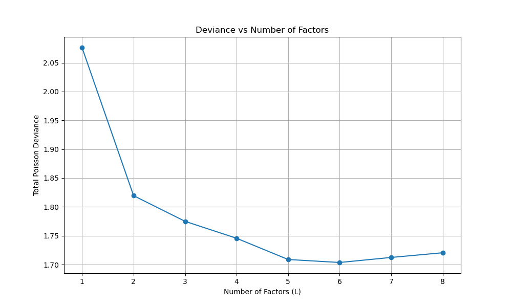
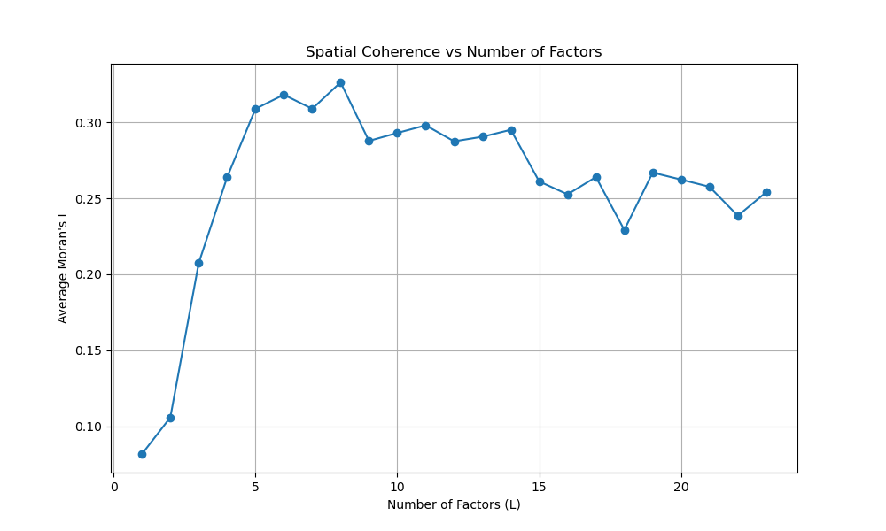
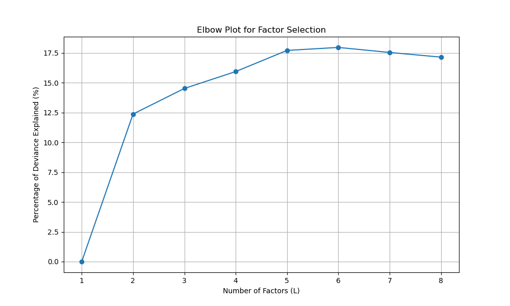

# Selecting the Optimal Number of Factors for mNSF

**Authors:** Yi Wang, Kasper Hansen, and the mNSF Team  
**Date:** March 2025

## Introduction

Selecting the optimal number of factors (L) is one of the most critical decisions when applying multi-sample Non-negative Spatial Factorization (mNSF). This tutorial demonstrates multiple approaches to factor selection using the synthetic dataset from the getting-started tutorial.

## Setup and Data Preparation

First, let's load the same synthetic dataset and set up our environment:

```python
# Import required packages
import os
import numpy as np
import pandas as pd
import matplotlib.pyplot as plt
import random
import tensorflow as tf
from os import path
import pickle

# Import mNSF modules
from mNSF import process_multiSample
from mNSF.NSF import preprocess, misc, visualize
from mNSF import training_multiSample
from mNSF import MoranI
from mNSF import mnsf_utility

# Set random seeds for reproducibility
random.seed(42)
np.random.seed(42)
tf.random.set_seed(42)

# Load the synthetic data created in the getting-started tutorial
simulated_data = mnsf_utility.pre_processing_simulation(
    n_samples=2,
    n_spots=100,
    n_genes=50,
    n_factors=5,  # True number of factors in the synthetic data
    output_dir="synthetic_data"
)

print(f"Generated synthetic data with:")
for i in range(2):
    print(f"Sample {i+1}: {simulated_data['list_Y'][i].shape[0]} spots, {simulated_data['list_Y'][i].shape[1]} genes")
```

## 1. Statistical Approach: Deviance Explained

One common approach is to evaluate how much variance or deviance is explained by different numbers of factors. For count data, Poisson deviance is often more appropriate than variance.

```python
# Set up parameters for evaluation
nsample = 2
nchunk = 1
max_factors = 8  # Maximum number of factors to test
mpth = path.join("models_synthetic_factor_selection")
misc.mkdir_p(mpth)

# Prepare data for mNSF
list_D = []
list_X = []

for ksample in range(nsample):
    # Load data
    sample_idx = ksample + 1
    Y = pd.read_csv(f"synthetic_data/Y_sample{sample_idx}.csv", index_col=0)
    X = pd.read_csv(f"synthetic_data/X_sample{sample_idx}.csv", index_col=0)
    
    # Process data using mNSF's get_D function
    D = process_multiSample.get_D(X, Y)
    list_D.append(D)
    list_X.append(D["X"])

# Get training data
list_Dtrain = process_multiSample.get_listDtrain(list_D)

# Calculate deviance for different numbers of factors
deviance_results = {}
for L in range(1, max_factors + 1):
    print(f"Evaluating model with {L} factors...")
    
    # Set up output directory
    pp = path.join(mpth, "pp", str(L))
    misc.mkdir_p(pp)
    
    # Set up induced points for each sample
    for ksample in range(nsample):
        ninduced = round(list_D[ksample]['X'].shape[0] * 0.20)
        rd_ = random.sample(range(list_D[ksample]['X'].shape[0]), ninduced)
        list_D[ksample]["Z"] = list_D[ksample]['X'][rd_, :]
    
    # Initialize and train model with L factors
    list_fit = process_multiSample.ini_multiSample(list_D, L, "nb")
    list_fit = training_multiSample.train_model_mNSF(
        list_fit, pp, list_Dtrain, list_D,
        num_epochs=5, nsample=nsample, nchunk=nchunk, verbose=False
    )
    
    # Calculate deviance for each sample
    total_deviance = 0
    for ksample in range(nsample):
        dev_result = visualize.gof(list_fit[ksample], list_D[ksample], Dval=None, S=10, plot=False)
        total_deviance += dev_result['tr']['mean']
    
    deviance_results[L] = total_deviance
    print(f"L={L}, Deviance={total_deviance:.4f}")

# Plot deviance vs number of factors
plt.figure(figsize=(10, 6))
plt.plot(list(deviance_results.keys()), list(deviance_results.values()), 'o-')
plt.xlabel('Number of Factors (L)')
plt.ylabel('Total Poisson Deviance')
plt.title('Deviance vs Number of Factors')
plt.grid(True)
plt.savefig("factor_selection_deviance.png")
plt.close()

print("Deviance results by number of factors:")
for L, deviance in deviance_results.items():
    print(f"L={L}: {deviance:.4f}")
```



## 2. Spatial Autocorrelation Approach: Moran's I

Another method is to evaluate the spatial coherence of the identified factors using Moran's I statistic:

```python
# Calculate Moran's I for each factor across different L values
morans_i_results = {}

for L in range(1, max_factors + 1+15):
    print(f"Calculating Moran's I for L={L}...")
    
    # Load the previously trained model
    pp = path.join(mpth, "pp", str(L))
    list_fit = process_multiSample.ini_multiSample(list_D, L, "nb")
    list_fit = training_multiSample.train_model_mNSF(
        list_fit, pp, list_Dtrain, list_D,
        num_epochs=0, nsample=nsample, nchunk=nchunk, verbose=False
    )
    
    # Calculate average Moran's I for each sample
    avg_morans_i = []
    for ksample in range(nsample):
        # Extract factors
        Fplot = misc.t2np(list_fit[ksample].sample_latent_GP_funcs(
            list_D[ksample]["X"], S=10, chol=False)).T
        
        # Calculate Moran's I for each factor
        factor_morans_i = []
        for i in range(L):
            I, p_value = MoranI.calculate_morans_i(list_D[ksample]["X"], Fplot[:, i])
            factor_morans_i.append(I)
        
        avg_morans_i.append(np.mean(factor_morans_i))
    
    # Store the average Moran's I across all samples
    morans_i_results[L] = np.mean(avg_morans_i)
    print(f"L={L}, Average Moran's I={morans_i_results[L]:.4f}")

# Plot Moran's I vs number of factors
plt.figure(figsize=(10, 6))
plt.plot(list(morans_i_results.keys()), list(morans_i_results.values()), 'o-')
plt.xlabel('Number of Factors (L)')
plt.ylabel('Average Moran\'s I')
plt.title('Spatial Coherence vs Number of Factors')
plt.grid(True)
plt.savefig("factor_selection_morans_i.png")
plt.close()
```


## 3. Elbow Method

We can also use the elbow method to determine the optimal number of factors by plotting the percentage of deviance explained:

```python
# Calculate percentage of deviance explained
null_deviance = deviance_results[1]  # Deviance with just 1 factor
pct_deviance_explained = {}

for L in range(1, max_factors + 1):
    pct_explained = 100 * (1 - deviance_results[L] / null_deviance)
    pct_deviance_explained[L] = pct_explained

# Plot percentage of deviance explained
plt.figure(figsize=(10, 6))
plt.plot(list(pct_deviance_explained.keys()), list(pct_deviance_explained.values()), 'o-')
plt.xlabel('Number of Factors (L)')
plt.ylabel('Percentage of Deviance Explained (%)')
plt.title('Elbow Plot for Factor Selection')
plt.grid(True)
plt.savefig("factor_selection_elbow.png")
plt.close()
```



### 4. Practical Guidelines for L Selection

Based on the approaches above, here are practical guidelines for selecting L:

1. **For exploratory analysis**: Start with a moderate value (L=4 to 8)
2. **For statistical robustness**: Use cross-validation with Poisson deviance
3. **For interpretability**: Examine spatial patterns and gene loadings
4. **For computational efficiency**: Consider resource constraints

| Dataset Complexity | Recommended L Range | Selection Approach |
|--------------------|---------------------|-------------------|
| Low (few cell types) | 2-6 | Visualization + Moran's I |
| Medium | 6-12 | Goodness-of-fit + Interpretability |
| High (many cell types) | 12-20+ | Cross-validation + Domain knowledge |

Remember that there's no single "correct" value of L - it depends on your biological question and dataset complexity.
