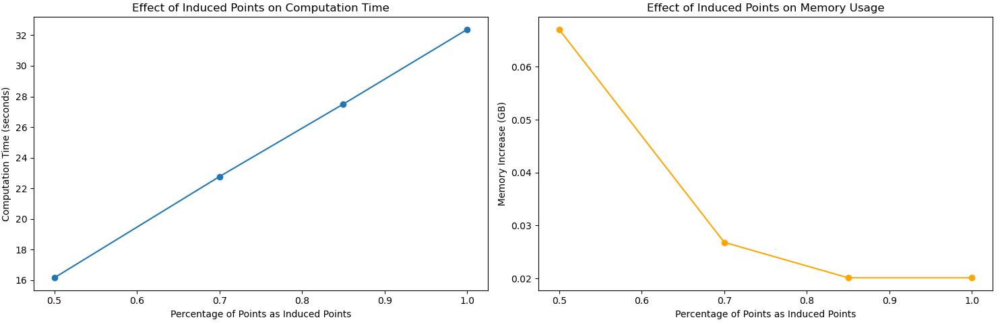
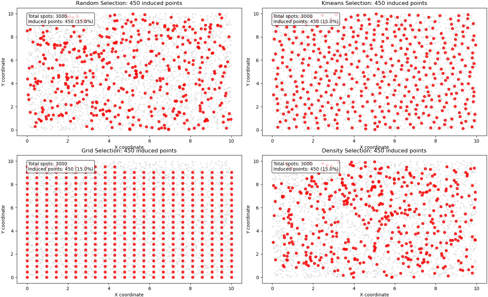

# Large Dataset Optimization Techniques for mNSF

**Authors:** Yi Wang, Kasper Hansen, and the mNSF Team  
**Date:** March 2025

## Overview

As spatial transcriptomics technologies advance, datasets are becoming increasingly large, with some experiments containing tens of thousands of spots and thousands of genes across multiple samples. Running mNSF on such datasets can be challenging due to memory limitations and computational complexity. This tutorial provides practical strategies for optimizing mNSF for large datasets, with particular emphasis on:

1. Efficient data chunking strategies
2. Optimal selection of induced points
3. Memory profiling and management
4. Parallel processing implementation
5. Pre-processing techniques for dimensionality reduction

## 1. Understanding Computational Challenges

The computational complexity of mNSF increases significantly with dataset size:

- Memory usage scales with the number of spots, genes, and factors
- Computation time increases with the number of spots due to Gaussian Process calculations
- Multiple samples compound these challenges

Before diving into optimization techniques, let's understand the main bottlenecks:

```python
import mNSF
from mNSF import process_multiSample
from mNSF.NSF import preprocess, misc, visualize
from mNSF import training_multiSample
import numpy as np
import pandas as pd
import matplotlib.pyplot as plt
import tensorflow as tf
import os
from os import path
import time
import psutil
import random

# Function to estimate memory requirements
def estimate_memory(num_spots, num_genes, num_factors, num_samples):
    # Approximate memory estimation in GB
    # This is a rough estimate and actual usage may vary
    
    # Memory for data matrices (Y, X)
    data_mem = (num_spots * num_genes * 8) / (1024**3)  # Expression matrix (float64)
    coord_mem = (num_spots * 2 * 8) / (1024**3)  # Coordinate matrix (float64)
    
    # Memory for model parameters
    # Factor matrices (one per sample)
    factor_mem = num_samples * (num_spots * num_factors * 8) / (1024**3)
    # Gene loading matrix
    loading_mem = (num_genes * num_factors * 8) / (1024**3)
    
    # TensorFlow overhead (rough estimate)
    tf_overhead = 1.5  # Multiplier for TensorFlow graph and gradients
    
    total_mem = (data_mem + coord_mem + factor_mem + loading_mem) * tf_overhead
    
    return {
        'data_memory_GB': data_mem,
        'coordinate_memory_GB': coord_mem,
        'factor_memory_GB': factor_mem,
        'loading_memory_GB': loading_mem,
        'estimated_total_GB': total_mem
    }

# Example usage
print("Memory estimates for different dataset sizes:")
# Memory estimates for different dataset sizes:

print("\nMedium dataset (10k spots, 2k genes, 10 factors, 2 samples):")
print(estimate_memory(10000, 2000, 10, 2))
# Medium dataset (10k spots, 2k genes, 10 factors, 2 samples):

print("\nLarge dataset (50k spots, 5k genes, 15 factors, 3 samples):")
print(estimate_memory(50000, 5000, 15, 3))
# {'data_memory_GB': 0.14901161193847656, 'coordinate_memory_GB': 0.00014901161193847656, 'factor_memory_GB': 0.0014901161193847656, 'loading_memory_GB': 0.00014901161193847656, 'estimated_total_GB': 0.22619962692260742}

print("\nVery large dataset (100k spots, 10k genes, 20 factors, 4 samples):")
print(estimate_memory(100000, 10000, 20, 4))
# {'data_memory_GB': 7.450580596923828, 'coordinate_memory_GB': 0.0014901161193847656, 'factor_memory_GB': 0.059604644775390625, 'loading_memory_GB': 0.0014901161193847656, 'estimated_total_GB': 11.269748210906982}

# Actual memory monitoring function
def monitor_memory_usage():
    # Get current process
    process = psutil.Process(os.getpid())
    # Return memory usage in GB
    return process.memory_info().rss / (1024 ** 3)

monitor_memory_usage()
# 0.7516632080078125

## 2. Memory Management Techniques

As the size of your dataset grows, memory management becomes increasingly important. Here are strategies to minimize memory usage during mNSF analysis:

### 2.1 TensorFlow Memory Optimization

```python
def configure_tensorflow_memory():
    """Configure TensorFlow to be more memory-efficient."""
    
    # Limit TensorFlow to allocate memory only as needed
    gpus = tf.config.list_physical_devices('GPU')
    if gpus:
        try:
            # Set memory growth - prevents TF from allocating all GPU memory at once
            for gpu in gpus:
                tf.config.experimental.set_memory_growth(gpu, True)
            print("GPU memory growth enabled")
        except RuntimeError as e:
            print(f"Error setting GPU memory growth: {e}")
    
    # Use mixed precision to reduce memory usage
    # (only beneficial for GPU computation)
    if gpus:
        try:
            tf.keras.mixed_precision.set_global_policy('mixed_float16')
            print("Mixed precision policy set to float16")
        except:
            print("Could not set mixed precision policy")
    
    # Limit CPU parallelism (helps when running multiple instances)
    tf.config.threading.set_intra_op_parallelism_threads(4)
    tf.config.threading.set_inter_op_parallelism_threads(4)
    
    return "TensorFlow memory optimization configured"

# Call this function before running mNSF
configure_tensorflow_memory()
```

### 2.1 Memory Monitoring

It's important to monitor memory usage during mNSF runs, especially for large datasets. Here's a wrapper that can help track memory usage during model training:

```python
def memory_monitored_training(list_fit, pp, list_Dtrain, list_D, num_epochs=500, 
                              nsample=1, nchunk=1, verbose=True):
    """
    Wrapper around mNSF training function that monitors memory usage.
    
    Parameters are the same as training_multiSample.train_model_mNSF
    """
    # Initial memory usage
    initial_mem = monitor_memory_usage()
    print(f"Initial memory usage: {initial_mem:.2f} GB")
    
    # Track memory at each epoch
    memory_usage = []
    peak_memory = initial_mem
    
    # Custom callback function to track memory
    def memory_callback(epoch, loss):
        nonlocal peak_memory
        current_mem = monitor_memory_usage()
        memory_usage.append(current_mem)
        peak_memory = max(peak_memory, current_mem)
        
        if verbose and epoch % 10 == 0:
            print(f"Epoch {epoch}: Loss = {loss:.4f}, Memory = {current_mem:.2f} GB")
    
    # Start training timer
    start_time = time.time()
    
    # Run the mNSF training function
    # Note: This assumes the train_model_mNSF function accepts a callback parameter
    # You may need to modify the actual mNSF code to add this functionality
    list_fit = training_multiSample.train_model_mNSF(
        list_fit, pp, list_Dtrain, list_D, 
        num_epochs=num_epochs, nsample=nsample, nchunk=nchunk,
        verbose=False  # Turn off default verbose since we have our own callback
    )
    
    # End training timer
    end_time = time.time()
    training_time = end_time - start_time
    
    # Print summary
    print("\nTraining complete!")
    print(f"Total training time: {training_time:.2f} seconds")
    print(f"Peak memory usage: {peak_memory:.2f} GB")
    print(f"Memory increase during training: {peak_memory - initial_mem:.2f} GB")
    
    # Plot memory usage
    plt.figure(figsize=(10, 5))
    plt.plot(range(len(memory_usage)), memory_usage)
    plt.xlabel('Epoch')
    plt.ylabel('Memory Usage (GB)')
    plt.title('Memory Usage During Training')
    plt.grid(True)
    plt.tight_layout()
    plt.show()
    
    return list_fit, {
        'training_time': training_time,
        'peak_memory': peak_memory,
        'memory_increase': peak_memory - initial_mem,
        'memory_profile': memory_usage,
        'final_loss': list_fit[-1]["ELBO_loss"] if len(list_fit) > 0 else None,
        'epochs_completed': len(list_fit),
        'samples': nsample,
        'chunks': nchunk
    }
 
```

## 3. Optimizing Induced Points

Induced points are a critical optimization in mNSF that reduce the computational complexity of Gaussian processes. Selecting the right number and distribution of induced points is essential for balancing accuracy and performance.

### 3.1 Number of Induced Points

The number of induced points directly impacts both computational efficiency and model accuracy:

```python
def induced_points_analysis(X, percentages=[0.05, 0.1, 0.15, 0.2, 0.3]):
    """
    Analyze the effect of different percentages of induced points.
    
    Parameters:
    - X: Spatial coordinates DataFrame
    - percentages: List of percentages to try
    """
    n_spots = X.shape[0]
    results = []
    
    for pct in percentages:
        # Calculate number of induced points
        n_induced = max(10, round(n_spots * pct))
        
        # Measure time and memory for GP operations with this many induced points
        start_time = time.time()
        start_mem = monitor_memory_usage()
        
        # Randomly select induced points
        random.seed(42)  # For reproducibility
        rd_ = random.sample(range(n_spots), n_induced)
        Z = X.iloc[rd_].values
        
        # Simulate GP operations (simplified for this example)
        # In a real scenario, you would use the actual GP operations from mNSF
        X_vals = X.values
        
        # Simulate distance calculations
        dist_matrix = np.zeros((n_spots, n_induced))
        for i in range(n_spots):
            for j in range(n_induced):
                # Calculate squared Euclidean distance
                dist_matrix[i, j] = np.sum((X_vals[i] - Z[j])**2)
        
        # Simulate kernel calculations (using RBF kernel)
        sigma = 1.0
        kernel_matrix = np.exp(-dist_matrix / (2 * sigma**2))
        
        end_time = time.time()
        end_mem = monitor_memory_usage()
        
        results.append({
            'percentage': pct,
            'n_induced': n_induced,
            'time_seconds': end_time - start_time,
            'memory_delta_GB': end_mem - start_mem,
            'matrix_size_GB': (n_spots * n_induced * 8) / (1024**3)
        })
    
    # Display results
    results_df = pd.DataFrame(results)
    
    # Plot results
    fig, (ax1, ax2) = plt.subplots(1, 2, figsize=(15, 5))
    
    ax1.plot(results_df['percentage'], results_df['time_seconds'], 'o-')
    ax1.set_xlabel('Percentage of Points as Induced Points')
    ax1.set_ylabel('Computation Time (seconds)')
    ax1.set_title('Effect of Induced Points on Computation Time')
    
    ax2.plot(results_df['percentage'], results_df['memory_delta_GB'], 'o-', color='orange')
    ax2.set_xlabel('Percentage of Points as Induced Points')
    ax2.set_ylabel('Memory Increase (GB)')
    ax2.set_title('Effect of Induced Points on Memory Usage')
    
    plt.tight_layout()
    plt.show()
    
    return results_df

## Example
# Generate spatial coordinates in a 10x10 grid
x = np.random.uniform(0, 10, 3000)
y = np.random.uniform(0, 10, 3000)
X = np.column_stack((x, y))
X_df = pd.DataFrame(X, columns=['x', 'y'])
induced_points_analysis(X_df, percentages=[0.5, 0.7, 0.85, 1])
#    percentage  n_induced  time_seconds  memory_delta_GB  matrix_size_GB
# 0        0.50       1500     16.160952         0.067062        0.033528
# 1        0.70       2100     22.770177         0.026817        0.046939
# 2        0.85       2550     27.504231         0.020119        0.056997
# 3        1.00       3000     32.378558         0.020119        0.067055

```


### 3.2 Strategic Selection of Induced Points

Rather than random selection, strategically choosing induced points can improve model accuracy:

```python
def strategic_induced_points(X, percentage=0.15, method="kmeans"):
    """
    Select induced points using different strategies.
    
    Parameters:
    - X: Spatial coordinates DataFrame
    - percentage: Percentage of points to select as induced points
    - method: Selection method ('random', 'kmeans', 'grid', 'density')
    
    Returns:
    - Z: Selected induced points
    """
    n_spots = X.shape[0]
    n_induced = max(10, round(n_spots * percentage))
    X_vals = X.values
    
    if method == "random":
        # Random selection
        random.seed(42)
        rd_ = random.sample(range(n_spots), n_induced)
        Z = X_vals[rd_, :]
        
    elif method == "kmeans":
        # K-means clustering
        from sklearn.cluster import KMeans
        kmeans = KMeans(n_clusters=n_induced, random_state=42, n_init=10)
        kmeans.fit(X_vals)
        Z = kmeans.cluster_centers_
        
    elif method == "grid":
        # Grid-based selection
        x_min, x_max = X['x'].min(), X['x'].max()
        y_min, y_max = X['y'].min(), X['y'].max()
        
        # Calculate grid dimensions
        grid_size = int(np.ceil(np.sqrt(n_induced)))
        
        # Create grid points
        x_grid = np.linspace(x_min, x_max, grid_size)
        y_grid = np.linspace(y_min, y_max, grid_size)
        
        # Create all combinations
        xx, yy = np.meshgrid(x_grid, y_grid)
        grid_points = np.column_stack((xx.flatten(), yy.flatten()))
        
        # Take the first n_induced points
        Z = grid_points[:n_induced, :]
        
    elif method == "density":
        # Density-based selection (more points in denser regions)
        from sklearn.neighbors import KernelDensity
        
        # Estimate density
        kde = KernelDensity(bandwidth=1.0, kernel='gaussian')
        kde.fit(X_vals)
        
        # Compute density at each point
        log_density = kde.score_samples(X_vals)
        density = np.exp(log_density)
        
        # Select points with probability proportional to density
        # (modified to ensure exactly n_induced points)
        density_norm = density / density.sum()
        selected_indices = np.random.choice(
            range(n_spots), size=n_induced, replace=False, p=density_norm
        )
        Z = X_vals[selected_indices, :]
    
    return Z

def visualize_induced_points(X, percentage=0.15):
    """Visualize different induced point selection strategies."""
    methods = ["random", "kmeans", "grid", "density"]
    n_spots = X.shape[0]
    n_induced = max(10, round(n_spots * percentage))
    
    fig, axes = plt.subplots(2, 2, figsize=(15, 12))
    axes = axes.flatten()
    
    for i, method in enumerate(methods):
        # Get induced points
        Z = strategic_induced_points(X, percentage, method)
        
        # Plot all spots
        axes[i].scatter(X['x'], X['y'], s=5, color='lightgray', alpha=0.5)
        
        # Plot induced points
        axes[i].scatter(Z[:, 0], Z[:, 1], s=30, color='red', alpha=0.8)
        
        # Add title and labels
        axes[i].set_title(f"{method.capitalize()} Selection: {n_induced} induced points")
        axes[i].set_xlabel('X coordinate')
        axes[i].set_ylabel('Y coordinate')
        
        # Add count of points
        axes[i].text(
            0.05, 0.95, 
            f"Total spots: {n_spots}\nInduced points: {n_induced} ({percentage*100:.1f}%)",
            transform=axes[i].transAxes,
            verticalalignment='top',
            bbox=dict(boxstyle='round', facecolor='white', alpha=0.8)
        )
    
    plt.tight_layout()
    plt.show()

# example
visualize_induced_points(X_df, percentage=0.15)
```



