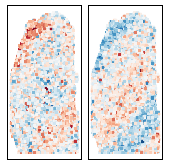

# Tutorial for mNSF Package - DLPFC data example

**Authors:** Yi Wang and Kasper Hansen  
**Date:** May, 2024

## Abstract

Multi-sample Non-negative Spatial Factorization (mNSF) is an advanced computational package that revolutionizes the analysis of spatial transcriptomics data across multiple samples. Building on the foundation of Non-negative Spatial Factorization (NSF), mNSF extends this methodology to simultaneously process and analyze multiple samples. This innovative approach enables the identification of common gene expression patterns across diverse samples without requiring cross-sample spot alignment. Such capability is particularly crucial when working with complex, multi-sample datasets where traditional alignment techniques often prove inadequate. By overcoming these limitations, mNSF opens new avenues for comprehensive spatial transcriptomics analysis, offering researchers a powerful tool to uncover shared biological features and sample-specific variations in spatial gene expression patterns.

## 1. Introduction

### 1.1 Overview

The emergence of spatial transcriptomics has transformed our approach to gene expression analysis by incorporating spatial context. While this advancement has been significant, many existing analytical methods are limited to single-sample data, constraining our ability to derive insights from multi-sample experiments. mNSF (multi-sample Non-negative Spatial Factorization) addresses this limitation by offering a robust framework for concurrent analysis of multiple samples.

#### Versatility of mNSF

The mNSF package demonstrates versatility in performing spatial factorization for:
- Multi-sample spatial transcriptomics data from various platforms (e.g., Visium, MERFISH, seqFISH)
- Other multi-sample feature-by-observation high-dimensional matrices with spatial components (e.g., spatial proteomics data)

#### Input Requirements

1. Data Matrices:
   - Feature-by-observation matrix
     * Rows represent features/genes
     * Columns represent observations/spots
     * Contains expression levels for each gene at each spatial location
   - Coordinate matrix for each observation
     * Provides spatial information (typically 2D or 3D coordinates) for each spot

2. Parameters:
   - Number of factors (L): Determines the number of spatial patterns to identify
   - Number of samples: Specifies the quantity of distinct samples in the dataset

#### Output

mNSF generates two key outputs:
1. Factor matrix for each sample
   - Each column represents a spatial factor
   - Shows how factors vary across the sample's spatial dimensions
2. Loading matrix
   - Demonstrates each gene's contribution to each factor
   - Rows correspond to genes, columns to factors

This comprehensive input-output structure allows mNSF to effectively capture and represent spatial patterns of gene expression across multiple samples, facilitating deeper insights into complex biological systems.


### 1.2 Citing mNSF

If you use this package in your research, it's important to provide proper attribution. Please cite:
Wang et al. (2024). Multi-sample non-negative spatial factorization. [Add full citation when available]

Proper citation ensures that the developers receive credit for their work and helps other researchers find and use the tool.

### 1.3 Dependencies

mNSF relies on several Python libraries to function. Here's a list of the main dependencies along with brief explanations of their roles:

```python
import random  # For generating random numbers, used in selecting induced points
import os  # For operating system dependent functionality like file path operations
import numpy as np  # For numerical operations on arrays and matrices
import tensorflow as tf  # For building and training the machine learning model
import pandas as pd  # For data manipulation and analysis
import sys  # For system-specific parameters and functions
import pickle  # For serializing and de-serializing Python object structures
from scanpy import pp  # For preprocessing single-cell data
from os import path  # For pathname manipulations
from mNSF import MoranI # For calculating spatial dependeicy of each factor within each sample, using Moran's I
```

These libraries provide essential functionality for data manipulation, numerical computations, and machine learning operations used in mNSF. Make sure all these dependencies are installed and up-to-date to avoid any issues when running mNSF.

## 2. Installation

You can install everything from the PyPI repository using `pip install -e .` but Tensorflow will most likely not install. A safer way would be to use conda to setup most of the packages then use pip to install.

### Install using pip

1. Git clone and activate your environment of choice.
2. [Install tensorflow](https://www.tensorflow.org/install).
3. `pip install -e .`

### Install using conda/mamba

1. Git clone this repo `git clone https://github.com/hansenlab/mNSF/` and enter `cd mNSF`.
2. Install `conda`. I recommend this distribution: https://github.com/conda-forge/miniforge. Do not install the full `anaconda`, it's highly bloated.
3. Create a new environment and install using

```sh
conda env create -n mnsf -f environment.yml
conda activate mnsf
```
The package should be available right away.

3. Install tensorflow.

<details>
  <summary>CPU only</summary>
  
    
    conda install tensorflow
    
</details>

<details>
  <summary>GPU</summary>
    If you have a GPU and is operating in a Linux system, you can in the `mnsf` environment.
  
    
    conda install tensorflow-gpu
    
</details>

If you encounter any issues during installation, check that all dependencies are correctly installed and that you're using a compatible Python version. For more detailed installation instructions or troubleshooting, please refer to the official documentation at: https://github.com/hansenlab/mNSF

## 3. Importing mNSF Package

After successful installation, you can import mNSF and its components as follows:

```python
import mNSF
from mNSF import process_multiSample
from mNSF.NSF import preprocess, misc, visualize
from mNSF import training_multiSample
```

Here's what each import does:
- `import mNSF`: Imports the main mNSF package
- `sys.path.append(dir_mNSF_functions)`: Adds the directory containing mNSF functions to the Python path
- `from mNSF import process_multiSample`: Imports functions for processing multiple samples
- `from mNSF.NSF import preprocess, misc, visualize`: Imports preprocessing, miscellaneous, and visualization functions from the NSF submodule
- `from mNSF import training_multiSample`: Imports functions for training the mNSF model on multiple samples

Make sure to replace `dir_mNSF_functions` with the actual path to the mNSF functions directory if it's not in your Python path. You can find this path by running `print(mNSF.__file__)` after importing mNSF, and then navigating to the parent directory of the file it prints.

## 4. Setting Up Parameters

Before running mNSF, you need to set up some key parameters. This step is crucial as it defines how the model will behave:

```python
L = 2  # Number of factors
nsample = 2  # Number of samples

# Set up paths for outputs
mpth = path.join("models")
misc.mkdir_p(mpth)
pp = path.join(mpth, "pp", str(2))
misc.mkdir_p(pp)
```

Let's break this down:

1. `L = 2`: This sets the number of factors the model will try to identify. Think of factors as spatial patterns or signatures in your data. The optimal number of factors can vary depending on your dataset and research question. You might need to experiment with different values of L to find the best fit for your data.

2. `nsample = 2`: This tells the model how many distinct samples are in your dataset. Make sure this matches the actual number of samples you're analyzing.

3. Setting up output directories:
   - `mpth = path.join("models")`: This creates a path for storing the trained models.
   - `misc.mkdir_p(mpth)`: This creates the directory if it doesn't exist.
   - `pp = path.join(mpth, "pp", str(2))`: This creates a subdirectory for storing preprocessing results.
   - `misc.mkdir_p(pp)`: This creates the preprocessing directory if it doesn't exist.

These directories will be used to save the results of your analysis, including trained models and preprocessed data. Make sure you have write permissions in the directory where you're running your script.

## 5. Data Preparation

### 5.1 Loading and Processing Data

mNSF requires your data to be in a specific format. Here's a detailed explanation of how to load and process your data:

```python
list_D = []
list_X = []

for ksample in range(nsample):
    Y = pd.read_csv('path/to/Y_features_sele_sample{ksample+1}_500genes.csv')
    X = pd.read_csv('path/to/X_allSpots_sample{ksample+1}.csv')
    D = process_multiSample.get_D(X, Y)
    list_D.append(D)
    list_X.append(D["X"])
```

This code does the following:

1. Initialize empty lists `list_D` and `list_X` to store processed data for each sample.

2. Loop through each sample:
   - `Y = pd.read_csv(...)`: Reads the gene expression data for the sample. The file should be a CSV where rows are genes and columns are spots.
   - `X = pd.read_csv(...)`: Reads the spatial coordinates for each spot in the sample.
   - `D = process_multiSample.get_D(X, Y)`: Processes the raw data using mNSF's `get_D` function. This function combines the expression and spatial data into a format that mNSF can work with.
   - `list_D.append(D)`: Adds the processed data to our list.
   - `list_X.append(D["X"])`: Extracts and stores just the spatial coordinates.

Make sure to replace 'path/to/' with the actual path to your data files. The file names assume a specific naming convention - adjust these if your files are named differently.

### 5.2 Preparing Input for mNSF

After loading the data, we need to prepare it for input into mNSF:

```python
list_Dtrain = process_multiSample.get_listDtrain(list_D)
list_sampleID = process_multiSample.get_listSampleID(list_D)

# Set induced points (15% of total spots for each sample)
for ksample in range(nsample):
    ninduced = round(list_D[ksample]['X'].shape[0] * 0.15)
    rd_ = random.sample(range(list_D[ksample]['X'].shape[0]), ninduced)
    list_D[ksample]["Z"] = list_D[ksample]['X'][rd_, :]
```

This code does the following:

1. `list_Dtrain = process_multiSample.get_listDtrain(list_D)`: Extracts the training data from our processed data. This function prepares the data in the format required for model training.

2. `list_sampleID = process_multiSample.get_listSampleID(list_D)`: Extracts sample IDs from the processed data. This helps keep track of which data belongs to which sample.

3. Setting up induced points:
   - Induced points are a subset of spatial locations used to reduce computational complexity while maintaining model accuracy.
   - For each sample:
     - `ninduced = round(list_D[ksample]['X'].shape[0] * 0.15)`: Calculates the number of induced points as 15% of total spots.
     - `rd_ = random.sample(...)`: Randomly selects the induced points.
     - `list_D[ksample]["Z"] = list_D[ksample]['X'][rd_, :]`: Stores the selected points in the data structure.

The number of induced points (15% here) is a trade-off between computational efficiency and accuracy. You might need to adjust this percentage based on your dataset size and available computational resources.

### 5.3 Choose the number of factors to be used

Selecting the optimal number of factors in factor analysis, including mNSF, is a complex task without a universal solution. This challenge stems from the trade-off between model simplicity and explanatory power. Too few factors may oversimplify the data, while too many can lead to overfitting. The difficulty is exacerbated by the unknown true number of underlying factors, which varies between data sets and research contexts.

Different statistical criteria often provide conflicting recommendations, and their effectiveness can depend on the specific data set. Researchers must balance statistical considerations with domain knowledge and practical constraints such as interpretability and computational resources.

In the context of mNSF, we use the goodness-of-fit Poisson deviance as one metric to help guide the selection of the number of factors. However, it's important to consider this metric in conjunction with other considerations.

The following code calculates the Poisson deviance for different numbers of factors across all samples:

```python
# get goodness-of-fit poisson deviance for each sample for each factor
for L in [4,8,12,16,20]:# finished running
	list_fit = process_multiSample.ini_multiSample(list_D, L, "nb")
	vec_dev = 0
	for ksample in range(0,nsample):
		dev_mnsf = visualize.gof(list_fit[ksample],list_D[ksample],Dval=None,S=10,plot=False)
		vec_dev= vec_dev + dev_mnsf['tr']['mean']
	print("L="+str(L))
	print("deviance="+str(vec_dev))
	print("")
```

This code does the following:
1. It iterates over different numbers of factors (L): 4, 8, 12, 16, and 20.
2. For each L, it initializes the mNSF model using `process_multiSample.ini_multiSample()`.
3. It then calculates the goodness-of-fit Poisson deviance for each sample using `visualize.gof()`.
4. The deviances are summed across all samples.
5. Finally, it prints the total deviance for each value of L.

Here are the results:

```plaintext
L=4
deviance=2.059812903404236
L=8
deviance=2.077596068382263
L=12
deviance=2.089587688446045
L=16
deviance=2.1100269556045532
L=20
deviance=2.1349778175354004
```

Interpretation of the results:

- The differences in deviance between different L values are relatively small, indicating that the model's fit doesn't drastically change with increasing factors.

Choosing the number of factors:

1. While the deviance suggests L=4 might be optimal, this should not be the sole criterion for selection.
2. Consider the biological interpretability of the factors. A slightly higher number of factors might reveal more biologically meaningful patterns, even if the statistical fit is slightly worse.
3. Evaluate the trade-off between model complexity and explanatory power. More factors increase the model's ability to capture complex patterns but also increase the risk of overfitting.
4. Take into account the computational resources required. Higher numbers of factors will increase computational time and memory usage.
5. Consider the specific context of your research. The "optimal" number of factors may vary depending on the biological system being studied and the research questions being asked.

Other possible ways for selecting the number of factors:

1. Visualize the spatial patterns for different numbers of factors to see how they change and assess their biological relevance.
2. Examine the gene loadings for different numbers of factors to see if additional factors reveal new, biologically meaningful gene sets.
3. If possible, validate the results against known biology or independent experiments to see which number of factors best captures the true underlying biology.
4. Consider using cross-validation or other model selection techniques to assess the model's performance on held-out data.
5. Consult with domain experts to evaluate the biological plausibility and interpretability of the factors identified with different L values.

The "best" number of factors often involves a nuanced balance between statistical fit, biological interpretability, computational resources, and research objectives. It's often helpful to try a few different values and compare the results before making a final decision. The process may involve iterative refinement and integration of multiple lines of evidence.


## 6. Model Initialization

Now we're ready to initialize the mNSF model:

```python
list_fit = process_multiSample.ini_multiSample(list_D, L, "nb")
```

This function does several important things:

1. It initializes the model parameters for all samples simultaneously.
2. The `L` parameter specifies the number of factors we want to identify, as set earlier.
3. The "nb" parameter specifies that we're using a negative binomial distribution for the data. This is often appropriate for count data like gene expression, as it can handle overdispersion better than a Poisson distribution.

The function returns a list of initialized model objects, one for each sample. These objects contain the initial parameter values that will be optimized during training.

## 7. Model Training

With the model initialized, we can now train it:

```python
list_fit = training_multiSample.train_model_mNSF(list_fit, pp, list_Dtrain, list_D, num_epochs=2)
```

This function trains the mNSF model using the prepared data. Here's what each parameter does:

- `list_fit`: The list of initialized model objects from the previous step.
- `pp`: The path where preprocessing results are stored.
- `list_Dtrain`: The training data prepared earlier.
- `list_D`: The full processed data.
- `num_epochs=2`: The number of training iterations. 

Note that `num_epochs=2` is likely too low for real-world applications. This is just for demonstration purposes. In practice, you might want to increase this number significantly (e.g., to 100 or 1000) for better results, but be aware that training time will increase accordingly. You may need to experiment to find the right balance between training time and model performance for your specific dataset.

The function returns a list of trained model objects, one for each sample. These objects contain the optimized parameters that best explain the spatial patterns in your data according to the mNSF model.

## 8. Visualizing Results

After training, we can visualize the results. Here's how to plot the mNSF factors for a sample:

```python
Fplot = misc.t2np(list_fit[0].sample_latent_GP_funcs(list_D[0]["X"], S=3, chol=False)).T
hmkw = {"figsize": (4, 4), "bgcol": "white", "subplot_space": 0.1, "marker": "s", "s": 10}
fig, axes = visualize.multiheatmap(list_D[0]["X"], Fplot, (1, 2), cmap="RdBu", **hmkw)
```




Let's break this down:

1. `Fplot = misc.t2np(list_fit[0].sample_latent_GP_funcs(list_D[0]["X"], S=3, chol=False)).T`:
   - This extracts the factor values for the first sample.
   - `sample_latent_GP_funcs` samples from the learned Gaussian process for each factor.
   - `S=3` means it takes 3 samples, which are then averaged for a smoother result.
   - `misc.t2np` converts the TensorFlow tensor to a NumPy array.
   - The `.T` at the end transposes the result for correct plotting.

2. `hmkw = {...}`: This sets up parameters for the heatmap visualization:
   - `figsize`: Sets the size of the figure.
   - `bgcol`: Sets the background color.
   - `subplot_space`: Sets the space between subplots.
   - `marker` and `s`: Set the type and size of markers for each spot.

3. `fig, axes = visualize.multiheatmap(...)`: This creates a heatmap of the spatial factors:
   - `list_D[0]["X"]`: The spatial coordinates for the first sample.
   - `Fplot`: The factor values we calculated.
   - `(1, 2)`: This specifies a 1x2 grid of subplots (one for each factor, since we set L=2).
   - `cmap="RdBu"`: This sets a red-blue colormap, which is good for visualizing positive and negative values.

This will produce a figure with two heatmaps, one for each factor, showing how these factors vary across the spatial dimensions of your sample.

## 9. Calculate Moran's I for each factor

After obtaining the spatial factors from mNSF, it's important to quantify how spatially structured these factors are. One way to do this is by calculating Moran's I statistic for each factor. Moran's I is a measure of spatial autocorrelation, which tells us whether similar values tend to cluster together in space.

Moran's I ranges from -1 to +1:
- Values close to +1 indicate strong positive spatial autocorrelation (clustering of similar values)
- Values close to -1 indicate strong negative spatial autocorrelation (dispersion of similar values)
- Values near 0 suggest random spatial distribution

Here's the code to calculate Moran's I for each factor:

```python
for i in range(L):
    I, p_value = MoranI.calculate_morans_i(list_D[0]["X"], Fplot[:, i])
    print(f"Factor {i+1} - Moran's I: {I:.4f}, p-value: {p_value:.4f}")
```

This code loops through each factor, calculates Moran's I using the spatial coordinates and factor values, and prints the results. The `calculate_morans_i` function returns both the Moran's I statistic and its associated p-value.

Here are the results for our two factors:

```
Factor 1 - Moran's I: 0.1983, p-value: 0.0010
Factor 2 - Moran's I: 0.1776, p-value: 0.0010
```

Interpretation of the results:

1. Both factors show positive Moran's I values, indicating that there is some degree of spatial clustering in both factors. Factor 1 (0.1983) shows slightly stronger spatial autocorrelation than Factor 2 (0.1776).

2. The p-values for both factors are very low (0.0010), which is well below the conventional significance threshold of 0.05. This suggests that the observed spatial patterns in both factors are statistically significant and unlikely to have occurred by chance.

3. While both factors show significant spatial structure, the Moran's I values are relatively modest (both less than 0.2). This indicates that while there is detectable spatial structure, it's not extremely strong. This could mean that the spatial patterns are subtle or that they're mixed with some degree of randomness.

4. The similarity in Moran's I values between the two factors suggests that they have comparable levels of spatial structure. This could indicate that both factors are capturing meaningful biological patterns at similar spatial scales.

These results support the validity of the mNSF analysis, as they demonstrate that the identified factors indeed capture statistically significant spatial patterns in the data. However, the modest Moran's I values also suggest that these patterns are complex and may benefit from further biological interpretation.

## 9. Further Analysis

To gain more insights, you might consider:
1. Visualizing these factors spatially (as we did in the previous step) to understand the nature of the clustering.
2. Examining the gene loadings for each factor to interpret their biological meaning.
3. Comparing these results across multiple samples to see if the spatial structures are consistent.

Remember that Moran's I is just one way to quantify spatial structure. Depending on your specific research questions, you might also consider other spatial statistics or domain-specific analyses to fully understand the patterns captured by mNSF.

You can repeat this process for each sample in your dataset to compare factors across samples. Look for patterns that are consistent across samples, as well as sample-specific variations.

## 10. Conclusion 

mNSF provides a powerful tool for analyzing multi-sample spatial transcriptomics data, allowing you to identify common factors across samples without the need for spatial alignment. This can be particularly useful for complex datasets where traditional alignment methods may fail, such as:

- Samples from different anatomical regions of the same organ
- Samples from different individuals or experimental conditions
- Datasets combining different spatial transcriptomics technologies

Some key advantages of using mNSF include:

1. Ability to handle multiple samples simultaneously, increasing statistical power
2. No requirement for cross-sample alignment, which can be challenging or impossible in some cases
3. Identification of both shared and sample-specific spatial patterns
4. Robust handling of count data through negative binomial modeling

When interpreting your results, consider the following:

- Look for factors that are consistent across samples, as these may represent fundamental biological patterns
- Pay attention to sample-specific factors, which could indicate individual variability or condition-specific effects
- Examine the gene loadings for each factor to understand the biological meaning of the spatial patterns
- Validate your findings with existing biological knowledge or additional experiments

Remember that the choice of parameters, particularly the number of factors (L), can significantly impact your results. It may be beneficial to run the analysis with different numbers of factors and compare the outcomes.

As with any computational method, it's important to critically evaluate the results in the context of your biological question and to validate key findings through independent methods when possible.

By leveraging the power of mNSF, you can gain new insights into the spatial organization of gene expression across multiple samples, potentially revealing complex patterns of tissue organization and function that may not be apparent from single-sample analyses.


